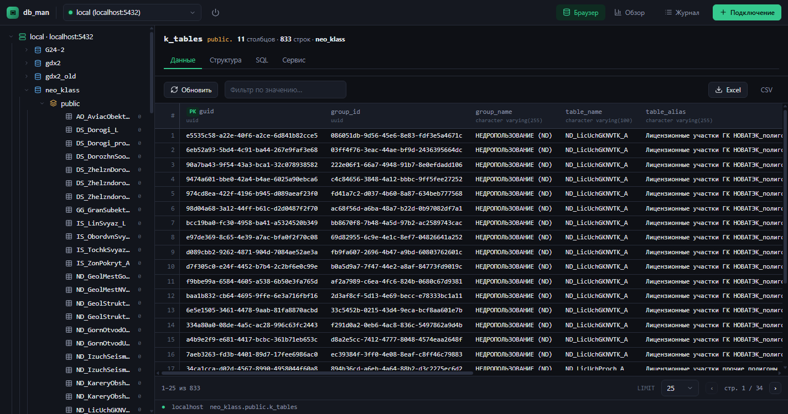

# db_man — PostgreSQL Browser

Веб-приложение для просмотра и обслуживания PostgreSQL: слева дерево
`подключение → база → схема → таблицы`, справа — данные выбранной таблицы
в табличном виде, а также структура, SQL и средства обслуживания.



Установка под РЕД ОС (systemd + nginx на `http://SERVER/db_man`) —
см. [docs/install-redos.md](docs/install-redos.md).

## Возможности

- **Дерево БД** — иерархия подключений, баз, схем и таблиц с ленивой загрузкой
  (данные подгружаются при раскрытии) и оценкой числа строк у каждой таблицы.
  Ширина панели дерева меняется перетаскиванием границы (выбор запоминается).
  Клик по базе данных открывает панели «Информация», «Сервис» и «Анализ» (таблица
  всех таблиц БД, первая колонка — схема), «Конфигурация» (параметры сервера из
  `pg_settings` с поиском), «DDL» (скрипт создания БД в порядке: база → расширения →
  схемы → таблицы → комментарии → индексы → внешние ключи → представления) и
  «Качество данных», клик по схеме — «Информация», «Сервис»
  (VACUUM/ANALYZE/REINDEX SCHEMA + агрегированная статистика), «Анализ», «DDL»
  (скрипт создания схемы) и «Качество данных».
  Таблицы анализа показывают комментарий таблицы (`COMMENT ON TABLE`), распухание
  (мёртвые кортежи), неиспользуемые и дублирующиеся индексы, флаг «нужен ANALYZE».
  Таблицы данных, структуры, индексов и анализа экспортируются в Excel.
- **Данные** — табличная сетка на TanStack Table: серверная сортировка, фильтр
  по значению, пагинация (LIMIT/offset), экспорт в Excel, CSV и SQL
  (INSERT-скрипты для переноса данных между окружениями); правый клик по ячейке —
  копировать значение или строку (TSV / INSERT).
- **Структура** — колонки с типами, NOT NULL, DEFAULT, первичными и внешними ключами.
- **SQL** — сгенерированный `CREATE TABLE` по `pg_catalog` с подсветкой синтаксиса.
- **Сервис** — размер таблицы (всего/таблица/индексы/TOAST), табличное
  пространство, `relfilenode`, оценка строк; список индексов с кнопкой
  «Перестроить» (`REINDEX INDEX`) и «Перестроить все» (`REINDEX TABLE`);
  неиспользуемые (`idx_scan = 0`) и дублирующиеся индексы помечаются;
  последний VACUUM/ANALYZE с относительными датами и кнопками запуска;
  раздел «Пространственный индекс» для таблиц с колонкой `geometry`/`geography`
  (показывается только при установленном расширении PostGIS) — перестроение
  существующего GiST-индекса или создание нового.
- **Журнал** — две вкладки: «Запросы» (все выполненные запросы с сервером,
  портом, БД, пользователем и DSN, экспорт в Excel/CSV) и «Действия» (аудит
  операций обслуживания — VACUUM/ANALYZE/REINDEX/создание пространственного
  индекса — с пользователем, объектом и результатом, экспорт в Excel/CSV).
  Обе — с очисткой.
- **Поиск объектов** — строка над деревом БД ищет таблицы, колонки и индексы
  по всем схемам текущей БД, клик по результату открывает таблицу.
- **Качество данных** — на уровне БД и схемы две проверки: «Пространственные данные»
  (таблицы с колонкой `geometry`/`geography` без пространственного индекса, с
  контекстным меню «Создать пространственный индекс») и «Таблицы без индексов»;
  обе — с экспортом.
- **Обзор** — крупнейшие таблицы по размеру, распухание (мёртвые кортежи),
  сводка и список неиспользуемых/дублирующихся индексов (recharts).
- **Темы** — светлая и тёмная, переключение кнопкой в правом верхнем углу
  (выбор сохраняется в `localStorage`).
- **Автоподключение** — при открытии приложение подключается к последней
  использованной конфигурации (если пароль не сохранён — запросит его).

## Безопасность

- **Пароли** по умолчанию хранятся только в памяти сервера и не возвращаются
  через API (в ответах — признак `hasPassword`). Опционально (чекбокс
  «Сохранить пароль» при создании подключения) пароль сохраняется в локальный
  SQLite (таблица `connection_secrets`) для автоматического подключения; в API
  он по-прежнему не отдаётся (только признак `hasSavedPassword`).
- Имена схем/таблиц/колонок из URL валидируются (`assertIdent`) и экранируются
  двойными кавычками — защита от SQL-инъекций.
- Пул соединений `pg` живёт на сервере, пароль БД не уходит в браузер.
- `VACUUM`/`ANALYZE`/`REINDEX` выполняются вне транзакций (пул в autocommit).

## Стек

**Сервер** (`server/`, Express + TypeScript): `express`, `pg`, `node:sqlite`
(конфигурации + журнал), `xlsx`, `cors`, `dotenv`, `tsx`.

**Клиент** (`client/`, React + Vite): `@tanstack/react-table`, `zustand`,
`lucide-react`, `react-hot-toast`, `recharts`, `react-router-dom`, `tailwindcss`,
собственные компоненты (`components/ui.tsx`).

## Запуск

Требуется Node.js ≥ 22.5 (для `node:sqlite`).

```bash
npm install
npm run dev        # сервер :3001 + клиент :5173
```

Откройте http://localhost:5173, добавьте подключение
(host / port / database / username / password).

## Конфигурация

Настройки сервера и клиента вынесены в `config.json` в корне:

```json
{
  "server": { "host": "127.0.0.1", "port": 3001, "sqlitePath": "./data/dbman.db" },
  "client": { "host": "127.0.0.1", "port": 5173, "apiProxy": "http://127.0.0.1:3001" }
}
```

- `server.host` / `server.port` — где слушает Express.
- `client.host` / `client.port` — dev-сервер Vite.
- `client.apiProxy` — куда Vite проксирует `/api` в режиме разработки.

Переменные окружения (`HOST`, `PORT`, `SQLITE_PATH` — шаблон в `server/.env.example`)
переопределяют значения из `config.json`.

## Nginx

Сервер приложения сам раздаёт SPA и API, поэтому достаточно проксировать весь
трафик на `server.host:server.port`. Полный пример — в `nginx.conf`:

```nginx
server {
    listen 80;
    location / {
        proxy_pass http://127.0.0.1:3001;
        proxy_set_header Host $host;
        proxy_set_header X-Forwarded-For $proxy_add_x_forwarded_for;
        proxy_read_timeout 600s;   # VACUUM/ANALYZE/REINDEX выполняются долго
    }
}
```

## Структура

```
db_man/
├── package.json          # workspaces: server + client
├── server/               # Express API
│   └── src/
│       ├── index.ts      # точка входа
│       ├── config.ts
│       ├── sqlite.ts     # node:sqlite (конфигурации + журнал)
│       ├── pools.ts      # пулы pg, пароли в памяти
│       ├── ident.ts      # безопасные идентификаторы
│       ├── db.ts         # каталог, данные, сервис/обслуживание (pg_catalog)
│       └── routes/       # connections, catalog, table, export, maintenance, logs
└── client/               # React SPA
    └── src/
        ├── store.ts      # zustand
        ├── api.ts
        ├── components/   # Topbar, Sidebar, DataView, StructureView, SqlView,
        │                 # ServiceView, ui (примитивы), модалки
        └── pages/        # Browser, Overview
```

## API

| Метод | Путь | Назначение |
|-------|------|------------|
| GET | `/api/connections` | список подключений |
| POST | `/api/connections` | создать (+тест соединения) |
| POST | `/api/connections/:id/connect` | подключиться (пароль необязателен) |
| GET | `/api/connections/:id/databases` | список баз |
| GET | `/api/connections/:id/databases/:db/schemas` | схемы |
| GET | `/api/connections/:id/databases/:db/schemas/:s/tables` | таблицы (+оценка строк) |
| GET | `…/tables/:t/columns` | колонки |
| GET | `…/tables/:t/rows?limit&offset&sort&dir&filter` | строки (+total) |
| GET | `…/tables/:t/export?format=xlsx\|csv` | экспорт |
| GET | `/api/connections/:id/databases/:db/stats` | размеры таблиц |
| GET | `/api/connections/:id/databases/:db/overview` | обзор: крупнейшие таблицы, распухание, неиспользуемые/дублирующиеся индексы |
| GET | `…/tables/:t/service` | сервис: размер/расположение, индексы, VACUUM/ANALYZE, пространственные индексы |
| POST | `…/tables/:t/service/reindex` | перестроить индекс (`{ index }`) |
| POST | `…/tables/:t/service/reindex-table` | перестроить все индексы (`REINDEX TABLE`) |
| POST | `…/tables/:t/service/vacuum` | `VACUUM` таблицы |
| POST | `…/tables/:t/service/analyze` | `ANALYZE` таблицы |
| POST | `…/tables/:t/service/spatial-index` | создать пространственный (GiST) индекс (`{ column }`) |
| GET | `/api/connections/:id/databases/:db/info` | информация о БД (размер, счётчики, кодировка) |
| GET | `/api/connections/:id/databases/:db/service` | статистика БД (`pg_stat_database`) |
| POST | `/api/connections/:id/databases/:db/service/vacuum` | `VACUUM` всей БД |
| POST | `/api/connections/:id/databases/:db/service/analyze` | `ANALYZE` всей БД |
| POST | `/api/connections/:id/databases/:db/service/reindex` | `REINDEX DATABASE` (все индексы БД) |
| GET | `/api/connections/:id/databases/:db/schemas/:s/info` | информация о схеме (размер, счётчики) |
| GET | `/api/connections/:id/databases/:db/schemas/:s/analysis` | анализ таблиц схемы (колонки/строки/размеры/комментарий/VACUUM/ANALYZE) |
| GET | `/api/connections/:id/databases/:db/schemas/:s/service` | статистика схемы (агрегат `pg_stat_all_tables`) |
| POST | `/api/connections/:id/databases/:db/schemas/:s/service/vacuum` | `VACUUM` всех таблиц схемы |
| POST | `/api/connections/:id/databases/:db/schemas/:s/service/analyze` | `ANALYZE` всех таблиц схемы |
| POST | `/api/connections/:id/databases/:db/schemas/:s/service/reindex` | `REINDEX SCHEMA` |
| GET | `/api/connections/:id/databases/:db/analysis` | анализ всех таблиц БД (первая колонка — схема, комментарий) |
| GET | `/api/connections/:id/databases/:db/config` | параметры сервера (`pg_settings`) |
| GET | `/api/connections/:id/databases/:db/ddl` | скрипт создания БД (DDL) |
| GET | `/api/connections/:id/databases/:db/search?q=` | поиск таблиц/колонок/индексов |
| GET | `/api/logs` | журнал запросов (пагинация: `limit`/`offset`) |
| DELETE | `/api/logs` | очистить журнал |
| GET | `/api/logs/export?format=xlsx\|csv&limit=&offset=` | выгрузка журнала (страница или весь) |
| GET | `/api/audit` | журнал действий (аудит обслуживания) |
| DELETE | `/api/audit` | очистить журнал действий |
